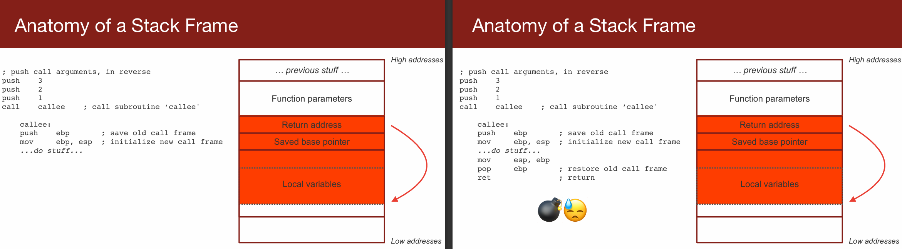
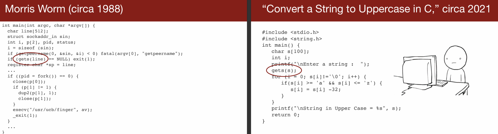
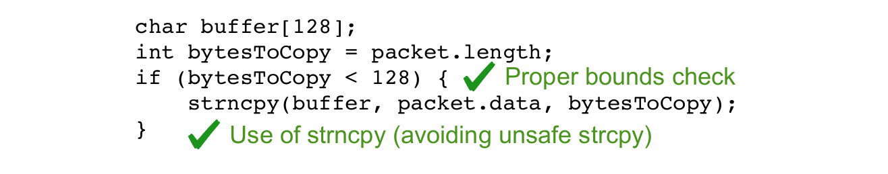

# L01 Welcome to CS 110L

---

**欢迎大家来到 [CS110L](https://reberhardt.com/cs110l/spring-2021/) 课程**，本课程由 [Ryan](https://www.youtube.com/@RyanEberhardt) 讲述，一起共同教学的是 Julio。

### 课程目标和内容
大多数同学选择这门课是因为对Rust感兴趣，本课程将专注于系统编程中常见的安全性和健壮性问题。我们将在接下来的学期中深入讨论这些内容。

### 课程结构和预期
对于没有Rust经验的同学，这门课程是完美的起点。对于有一定Rust基础的同学，课程前几周可能会相对基础，但后续内容将涉及更高级的主题。我们鼓励大家加入课程的Slack交流平台，与其他同学分享和交流。

### C语言的示例
通过一个C语言的示例讨论了缓冲区溢出的问题和潜在的安全风险，解释了如何通过非法操作内存导致程序的远程代码执行，这是很多病毒的工作原理。

### 网络监听与信息收集
FingerD是一个在网络上监听并响应网络请求的程序，用于获取某台计算机的用户信息。尽管在当今看来这种做法因网络设备众多而显得不太实用，但在过去，这是一种常见的程序。

### 漏洞与安全问题
通过一个名为Morris Worm的例子，展示了如何通过利用网络服务程序（如FingerD）的漏洞进行攻击。这种攻击主要是通过发送恶意的超出缓冲区限制的信息来实现的，从而导致程序崩溃或被恶意控制。这起事件虽然最初并无恶意，却因为程序过于占用资源而导致了广泛的网络瘫痪。

### 汽车电子系统的安全漏洞
介绍了一个关于汽车电子系统安全的研究，研究者试图通过各种方式入侵汽车的不同电子部分。特别指出，现代高端汽车通过内置的蜂窝数据连接进行远程通信和控制，这增加了被黑客攻击的风险。研究者通过精巧的逆向工程，成功利用声音文件通过汽车的电话系统操控汽车，突显了汽车系统的安全漏洞。

### 软件开发中的常见错误
讨论了软件开发中常见的错误，如缓冲区溢出，这是导致安全漏洞的主要原因之一。通过Chrome OS的例子说明了即使是一字节的缓冲区溢出也可能导致严重的安全后果。此外，还讨论了数据类型在C语言中的隐式转换问题，这可能导致程序行为出现意外，增加了安全风险。

### 防范措施和建议
讨论如何通过改进编程工具和开发流程来减少这类错误的发生。Rust语言因其在内存安全方面的优势被提出作为一个潜在的解决方案。整个课程的目的是让学生了解这些复杂问题，并教授他们如何编写更安全的代码。

### 为什么使用Rust
Rust语言通过安全且经过界限检查的封装来管理内存，这意味着Rust能够保证缓冲区的安全性，因为它在编译时就能检测到潜在的风险。这种机制可以有效防止由于缓冲区溢出导致的安全问题，这是C/C++中常见的问题。

### 改进内存管理策略
在C/C++中，改进的策略包括存储缓冲区长度和指针，以确保这两者之间的一致性。这可以防止由于长度和实际内存空间不一致而导致的溢出。例如，在Rust中，数组和缓冲区的长度是其类型的一部分，编译器可以自动检查数组索引是否越界。

### 强类型系统和编译器警告
强化类型系统和调整编译器设置，使其能够提出警告并将潜在的错误升级为严重错误，如禁止隐式类型转换，这也是减少错误的有效方法。例如，可以配置编译器以阻止将有符号整数隐式转换为无符号整数，这是导致安全漏洞的常见原因。

### 动态与静态分析工具的使用
动态分析工具如Valgrind能够在程序运行时监测其行为，捕捉如内存泄漏等问题。然而，由于无法覆盖所有输入，其效果有限。静态分析则在不运行代码的情况下分析代码的静态特性，如通过查找特定的危险函数调用。尽管这些方法有其局限性，但它们在预防和发现程序中的错误方面发挥了重要作用。

### 程序测试的重要性和限制
讲座指出，即使是广泛的测试也不能保证软件完全无错误，因为测试不能覆盖所有可能的输入场景。这就引出了使用如模糊测试等技术，这种技术通过生成大量随机输入来测试程序，以尽可能地发现潜在的错误。

### 静态与动态分析的讨论
讲座中讨论了静态分析的限制，尤其是在处理复杂程序时的挑戰，例如停机问题（Halting Problem），即无法通过分析代码本身确定程序是否会终止。而动态分析虽然可以在程序运行时发现问题，但它依赖于实际输入，无法覆盖所有可能的输入情况。

### Rust语言的内存安全特性
Rust通过编译时的严格内存安全检查，减少了如缓冲区溢出等常见的内存错误。这些功能使得Rust在编写安全代码方面具有优势，是教学中将要重点讨论的内容。

### 课程结构和期望
本课程虽然使用Rust进行教学，但主要目的不是教授Rust的高级特性，而是通过Rust来学习如何预防和识别编程中的错误。课程内容将包括内存安全、多线程编程和网络编程等，旨在通过实际项目来强化这些概念。

### 课程项目和练习
课程中包括两个主要项目，一个是实现自己的调试器（类似GDB），另一个是开发一个高性能的Web服务器。这些项目旨在将课堂学习的理论知识应用于实际的编程任务中。

### 课程互动和支持
教师鼓励学生通过Slack进行交流，并在课后留出时间进行答疑，以帮助学生解决学习中遇到的问题。同时，学生也被鼓励将学习体验和挑战写成博客，以促进深入学习并分享经验。

---

## 86体系结构中的堆栈帧结构

关于x86体系结构中的堆栈帧结构。堆栈帧被用于函数调用过程中，以维持函数的局部变量、传递参数、保存返回地址以及保持调用前后的堆栈状态不变。

### 堆栈帧的结构

堆栈帧主要包括以下几个部分：

1. **函数参数** - 这些是传递给函数的参数，通常在函数调用之前由调用者推入堆栈。
2. **返回地址** - 这是程序继续执行的下一条指令的地址，当函数调用完成后，控制权需要返回到这个位置。
3. **保存的基指针** - 基指针（通常是EBP寄存器的值）在调用新函数前被保存下来，新函数可以更改EBP寄存器的值。
4. **局部变量** - 函数内部声明的局部变量会存储在这里。

### 函数调用过程示例

以下是一个函数调用的例子，使用的是标准的CDECL调用约定（在C/C++中常用），其中调用者负责清理堆栈：

```x86asm
; 假设我们要调用一个函数，函数原型为 callee(int, int, int)
push 1        ; 推送第三个参数
push 2        ; 推送第二个参数
push 3        ; 推送第一个参数
call callee   ; 调用函数
add esp, 12   ; 清理传递给函数的参数
```

### 函数内部的堆栈操作

在函数`callee`内部，堆栈帧的构建如下：

```x86asm
callee:
  push ebp            ; 保存旧的基指针
  mov ebp, esp        ; 新的基指针设置为当前堆栈指针
  ; 函数体内做一些操作
  ...
  mov esp, ebp        ; 恢复旧的堆栈指针
  pop ebp             ; 恢复旧的基指针
  ret                 ; 返回到调用者的代码
```

这个示例说明了在x86体系结构下函数调用的过程，以及如何通过堆栈帧管理函数的局部环境和调用状态。堆栈帧使得函数调用可以嵌套和递归，同时保持每个函数调用的环境独立于其他调用。



## 缓冲区溢出

x86体系结构下的函数调用和堆栈帧管理过程经常与缓冲区溢出（Buffer Overflow）等安全问题相关联。缓冲区溢出是一种常见的安全漏洞，通常发生在当程序向一个固定长度的缓冲区内写入更多数据时，超出了缓冲区的边界，导致相邻内存区域的数据被覆盖。这种覆盖可以修改堆栈上的返回地址，从而允许攻击者控制程序的执行流程。

### 堆栈溢出示例

在上面的示例中，如果`callee`函数的局部变量处理不当，比如对传入的参数未做长度检查直接存储，就可能覆盖堆栈上的其他重要数据（如返回地址）。以下是一个简单的例子：

```x86asm
callee:
  push ebp
  mov ebp, esp
  sub esp, 8        ; 为两个局部变量分配空间
  mov [ebp-4], eax  ; 假设eax中存储着传入的数据，这里未检查长度
  mov [ebp-8], ebx  ; 另一个局部变量
  ...
  mov esp, ebp
  pop ebp
  ret
```

如果传入的数据（例如从`eax`载入的数据）超出了为局部变量预分配的空间大小，就可能会发生堆栈溢出，覆盖掉基指针或返回地址等关键控制数据。

### Rust语言的内存安全

Rust语言设计了一系列的内存安全保障措施，旨在编译时就消除或减少这类问题的发生。Rust通过所有权（Ownership）、借用（Borrowing）、生命周期（Lifetimes）等机制，确保内存安全，避免悬垂指针和数据竞争等问题。例如，Rust中的所有权系统会确保每一个数据只有一个所有者；当所有者离开作用域时，数据将被自动回收，不会造成内存泄漏。

### Rust中的内存管理示例

在Rust中，如果你尝试使用超出数组边界的索引，编译器将阻止你的程序编译通过，或者在运行时立即终止程序：

```rust
fn main() {
    let arr = [1, 2, 3];
    let index = 3;  // 故意使用一个超出边界的索引
    println!("{}", arr[index]);  // 这里将在运行时引发panic
}
```

这种严格的内存访问控制有效防止了像C/C++中常见的堆栈溢出和其他内存安全问题，是Rust在系统编程中被广泛推崇的原因之一。通过使用Rust，可以建立更加安全的软件系统，特别是在需要处理大量敏感数据和安全要求高的场合（如操作系统、网络服务器等）。

---



这两段代码分别展示了在C语言中的缓冲区溢出问题。这种问题在历史上曾导致许多安全漏洞，例如1988年的Morris Worm和近期的各种应用漏洞。下面我将分析这两段代码的主要问题和潜在的风险。

### Morris Worm (大约1988年)

```c
int main(int argc, char *argv[]) {
    char line[512];  // 声明一个512字节的字符数组
    struct sockaddr_in sin;
    int i, p[2], pid, status;
    i = sizeof(sin);

    if (getpeername(0, &sin, &i) < 0) fatal(argv[0], "getpeername");
    if (gets(line) == NULL) exit(1);  // 使用gets函数读取输入

    // 省略了一些代码

    if ((pid = fork()) == 0) {
        close(p[0]);
        if (p[1] != 1) {
            dup2(p[1], 1);
            close(p[1]);
        }
        execv("/usr/ucb/finger", av);  // 执行外部程序
        _exit(1);
    }

    // 省略了一些代码
}
```

**分析**:
- `gets(line)`: `gets`函数是一个已知的不安全函数，因为它不检查目标缓冲区的大小，导致溢出的风险。在此代码中，如果输入超过512个字符，将会溢出`line`数组，可能覆盖相邻内存区域，包括返回地址或其他重要的控制数据。
- `execv("/usr/ucb/finger", av)`: 这里尝试执行外部程序，如果前面的`line`数组已经被恶意溢出，攻击者可能通过修改控制流来执行任意代码。

### 将字符串转换为大写 (大约2021年)

```c
#include <stdio.h>
#include <string.h>

int main() {
    char s[100];  // 声明一个100字节的字符数组
    int i;
    printf("\nEnter a string : ");
    gets(s);  // 使用gets函数读取字符串

    for (i = 0; s[i] != '\0'; i++) {
        if (s[i] >= 'a' && s[i] <= 'z') {
            s[i] = s[i] - 32;  // 将小写字母转换为大写
        }
    }
    printf("\nString in Upper Case = %s\n", s);
    return 0;
}
```

**分析**:
- `gets(s)`: 和上一个示例一样，使用`gets`函数导致缓冲区溢出的风险。用户如果输入超过100个字符，将溢出`s`数组，可能导致程序崩溃或更严重的安全问题。

### 总结

这两段代码示例都突出显示了C语言中`gets`函数的危险性。从1990年代开始，很多安全指导已经建议避免使用`gets`，并在C11标准中最终将其从库中移除。在现代C或C++编程中，推荐使用`fgets`或其他安全的字符串处理函数，这些函数需要指定缓冲区大小，从而避免缓冲区溢出问题。在Rust等现代编程语言中，类似问题通过编译器和语言设计得到了本质的解决，强制内存安全，并减少此类安全漏洞的发生。

---



## 代码示例分析

这段代码虽然采取了适当的边界检查和使用了`strncpy`来代替不安全的`strcpy`，这确实是提高代码安全性的良好实践。然而，存在一个潜在的问题是，`bytesToCopy`变量是一个`int`类型，这意味着它可能为负数，这在进行缓冲区操作时可能导致安全隐患。

```c
char buffer[128];
int bytesToCopy = packet.length;
if (bytesToCopy < 128) {
    strncpy(buffer, packet.data, bytesToCopy);
}
```

**问题分析**：
1. **类型兼容性**：`bytesToCopy`被定义为`int`类型，而`packet.length`的类型未明确。如果`packet.length`是无符号类型，将其赋值给`int`类型的`bytesToCopy`可能导致隐式类型转换。如果`packet.length`的值超出了`int`能表示的正数范围，这种转换可能导致值变为负数，从而引发安全问题。
2. **隐式转换风险**：在`strncpy`函数的调用中，`bytesToCopy`作为第三个参数，它需要是一个`size_t`类型，`size_t`是一个无符号类型。如果`bytesToCopy`为负，当它被隐式转换为`size_t`时，会转换为一个非常大的正数，可能导致从`packet.data`读取大量未预期的数据到`buffer`，引起缓冲区溢出。

### 改进后的代码

为了解决这些问题，我们可以采取以下措施：

1. **使用合适的数据类型**：使用`size_t`类型替代`int`来定义`bytesToCopy`，避免因负数而导致的隐式转换问题：
   ```c
   char buffer[128];
   size_t bytesToCopy = packet.length;  // 使用size_t以保证非负数
   if (bytesToCopy < 128) {
       strncpy(buffer, packet.data, bytesToCopy);
   }
   ```

2. **确保字符串安全终止**：在使用`strncpy`后，应确保`buffer`以`'\0'`字符安全终止，防止创建不正确终止的字符串：
   ```c
   if (bytesToCopy < 127) {
       strncpy(buffer, packet.data, bytesToCopy);
       buffer[bytesToCopy] = '\0';  // 手动添加终止字符
   } else {
       strncpy(buffer, packet.data, 127);
       buffer[127] = '\0';
   }
   ```

通过这些改进，我们不仅解决了因隐式类型转换可能导致的问题，还增加了额外的安全检查来确保代码的健壮性和安全性。这样的做法有助于预防由数据类型不匹配引起的安全漏洞，提高代码在处理不同数据源时的稳定性和安全性。

---

## 动态分析

### 动态分析的定义

动态分析是一种在程序运行时检测和分析其行为的技术。它通过观察程序在执行过程中的行为来发现潜在的问题，如内存泄漏、缓冲区溢出、竞态条件等。

### 动态分析的特点

1. **运行程序**：动态分析涉及实际运行程序并监视其操作，这与静态分析不同，后者是在不运行程序的情况下分析代码。
2. **依赖输入**：动态分析的效果取决于输入数据的质量和多样性。如果测试输入不能覆盖所有的执行路径，则某些问题可能不会被发现。
3. **组合技术**：通常会结合使用多种技术来增加发现错误的几率，例如模糊测试（fuzzing），它通过自动生成大量随机输入数据来测试程序，试图触发异常或失败。

### 动态分析的局限性

尽管动态分析是发现程序错误的强大工具，但它有一些局限性：
- **不完全保证**：即使经过广泛的动态测试，也无法保证软件完全无缺陷。某些问题可能只在特定的、未被测试的输入或环境下出现。
- **性能开销**：动态分析可能需要额外的运行时支持，这可能会影响程序的性能，尤其是在使用如动态插桩或详细的日志记录时。
- **测试范围**：它通常只能检测到对当前测试输入敏感的问题。不同的输入可能揭示新的问题，因此动态分析需要持续的输入更新和测试案例的改进。

### 动态分析的实用场景

1. **性能分析**：动态分析工具可以帮助识别程序中的性能瓶颈，如CPU或内存使用高的区域。
2. **安全测试**：通过动态分析，安全研究人员可以识别和利用安全漏洞，如在网络应用中执行的注入攻击。
3. **质量保证**：软件测试人员使用动态分析来验证程序的功能和行为是否符合预期规范。

### 结论

动态分析是软件开发和维护中不可或缺的一部分，特别是在进行复杂系统的安全和性能评估时。虽然它不能完全保证找出所有的缺陷，但它提供了一个实用的方法来增加软件的健壮性和可靠性。为了最大化其效用，它应与静态分析、单元测试和其他质量保证措施结合使用。

---

## 静态分析

### 静态分析的定义

静态分析是在不执行程序的情况下，通过检查源代码来查找潜在问题的过程。这种分析方法可以在软件开发早期发现错误，提高代码质量，确保遵守编程标准。

### 静态分析的特点

- **识别问题代码**：通过分析源代码，静态分析工具能够识别出可能导致错误的代码部分，例如未初始化的变量、可能的内存泄漏、无效的函数调用等。
- **简单情况下的有效性**：在一些简单的情况下，静态分析特别有效，如检测到危险的函数调用（例如`gets()`）。当检测到这类函数时，可以立即标记为错误或警告，因为这类函数已知存在安全风险。
- **普遍性问题**：在通用情况下，静态分析可能无法完全解决某些问题，例如“停机问题”（Halting Problem）。停机问题是指无法确定一个程序是否会在有限的步骤后停止。

### 静态分析的挑战

- **停机问题**：这是理论上的限制，表明不可能通过任何算法来决定任意程序对于任意输入是否最终停止运行。这意味着静态分析不能保证找出所有可能的运行时错误或行为。
- **误报和漏报**：静态分析工具可能产生误报（报告不存在的错误）和漏报（未检测到实际存在的错误），这可能会影响其在实际开发中的应用效果。

### 提高静态分析的可行性和有用性

- **改进算法和技术**：开发更高级的算法和技术，以提高分析的准确性，减少误报和漏报。
- **定制化规则**：根据具体的开发环境和需求定制化分析规则和策略，提高分析的相关性和有效性。
- **集成开发环境**：将静态分析工具更好地集成到开发环境中，使得在编写代码的同时即可获得反馈，从而提早修复潜在问题。
- **教育和培训**：教育开发者了解静态分析的重要性和使用方法，增强其在日常编程中的应用。

### 总结

静态分析是提高软件质量和安全性的重要工具，虽然存在一些理论和实际的限制，但通过不断的技术进步和适当的应用策略，可以极大地增强其效用。未来的讲座和讨论将进一步探讨如何克服现有挑战，发挥静态分析在软件开发中的最大潜力。

---

## 课程大纲

### 课程核心问题：如何预防系统编程中的常见错误？

### 课程内容概述

1. **Rust编程实践**
   - 尽管这不是一个专门教授Rust的课程，但所有编程练习都将使用Rust进行。Rust是一种现代系统编程语言，以其内存安全性而闻名。

2. **在C/C++中预防常见错误**
   - 将讨论如何在C/C++编程中识别和预防常见的编程错误，如内存泄漏、缓冲区溢出等。

3. **Rust类型系统的优势**
   - 探讨Rust的类型系统如何帮助预防常见的内存安全错误。Rust的所有权、借用和生命周期特性在系统编程中提供了额外的安全保障。

4. **良好代码架构的设计**
   - 讨论如何设计良好的代码架构，包括模块化设计、代码复用、接口定义等，以提高代码的可维护性和可扩展性。

5. **避免多进程和多线程编程的陷阱**
   - 多进程和多线程编程常见的问题及其解决策略。这包括进程间通信、线程同步、死锁预防等。

6. **实践应用：网络系统**
   - 将所学内容应用到网络系统的设计和实现中，这是检验学习成果的实战环节，涵盖了网络编程的基础知识和常见问题。
