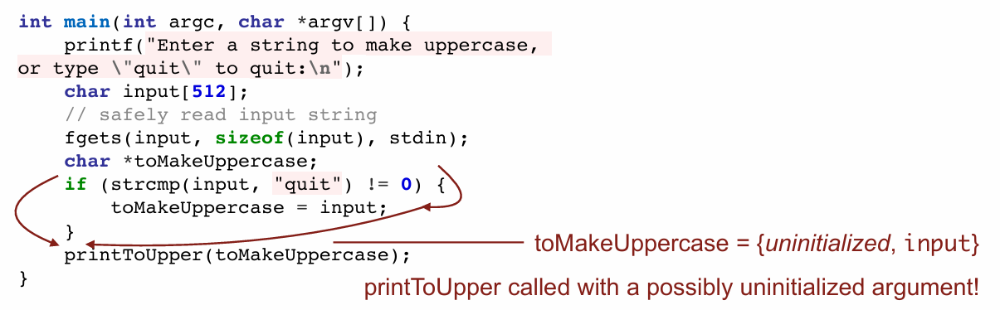

# L02 Program Analysis

---

## 动态分析和静态分析

在上次课程中，我们讨论了两种主要的技术类别：

1. **动态分析**：即运行程序并观察其行为。这种方法不特定于计算机科学，数学家也长期以来一直在使用动态分析方法来描述不同数字的组合。例如，使用Valgrind这种工具来检测代码执行中的错误，如越界访问、使用未初始化的内存等。Valgrind通过在运行时修改汇编代码来实现，它会拦截如malloc这样的函数调用，并用自己的版本替换，以追踪所有的内存分配和访问。

2. **静态分析**：不运行程序，而是直接阅读源代码以发现潜在的错误。这种方法依赖于对代码的直接分析，而不涉及实际的执行过程。

## Valgrind的工作原理

Valgrind是一种动态分析工具，它通过以下步骤来检测和报告程序中的错误：

- **编译代码**：首先通过GCC或Clang等编译器编译代码，生成二进制文件。
- **修改汇编代码**：在程序执行时，Valgrind实时修改汇编代码，例如将malloc调用替换为其内部版本，以便可以监控所有的内存分配。
- **插入额外的汇编指令**：Valgrind会在每次内存读取或写入时插入额外的汇编指令，以跟踪这些操作并确保它们不会访问非法的内存区域。
- **生成报告**：当检测到如堆缓冲区溢出等问题时，Valgrind会报告具体的错误，如"无效写入大小4"，指出程序尝试写入非法的堆内存区域。


## Valgrind的实用性和限制

Valgrind非常适用于检测包括堆内存错误在内的多种运行时错误，但它对栈内存的错误检测能力有限，因为它不会跟踪栈内存分配。此外，Valgrind不需要源代码即可工作，这使得它也可以用于分析丢失源代码的旧软件。然而，Valgrind不能识别所有类型的错误，特别是当错误涉及到栈缓冲区溢出时，它可能无法提供有效的警告或错误信息。

## 下一代工具：Sanitizers

在最近几年，出现了被称为sanitizers（清理器）的新一代工具，这些工具提供了比Valgrind更先进的分析功能，主要体现在如何“插装”（instrumenting，即在代码中插入额外的监控和检查逻辑）源代码而非汇编代码。

### 源代码插装

不同于Valgrind对汇编代码进行插装，sanitizers直接对源代码进行插装。这种方法允许sanitizers在编译过程中插入额外的代码来检测和防止错误，例如栈溢出。例如，当你在栈上分配一个尺寸为8的缓冲区但却写入超出其范围时，sanitizers能够在源码级别识别出缓冲区的界限，并在每次内存访问时检查是否越界。


### Sanitizers的优势

Sanitizers的一大优势在于它们能够利用源代码中的额外信息，例如变量名和数据结构，从而提供更准确的错误信息和更容易的错误跟踪。此外，因为它们在更高的抽象层次上操作，sanitizers通常更易于实现和维护。

#### 常见的Sanitizers类型：

1. **Address Sanitizer**：检测越界访问。
2. **Leak Sanitizer**：发现内存泄漏。
3. **Memory Sanitizer**：检查未初始化内存的使用。
4. **Undefined Behavior Sanitizer**：检测因整数溢出等原因引起的未定义行为。
5. **Thread Sanitizer**：在多线程程序中检测线程使用错误。

### 实用性和局限性

虽然sanitizers提供了强大的错误检测能力，但它们并不是万能的。首先，sanitizers可能会增加程序的运行时开销，这在性能敏感的应用中可能是一个问题。其次，尽管sanitizers能够检测许多常见的编程错误，但它们不能发现所有类型的错误，特别是那些依赖于特定硬件或系统配置的问题。

### 为何不普遍使用Sanitizers？

尽管sanitizers非常有用，但它们并不总是被广泛使用。主要原因包括对程序性能的影响、对开发和测试过程的复杂性增加，以及在某些情况下对源代码的侵入性可能较高。此外，一些旧的或遗留系统可能难以集成现代的sanitizers工具。

总之，sanitizers是强大的工具，可以帮助开发者发现并修复代码中的错误，但它们需要在性能、便利性和检测能力之间做出权衡。

## 动态分析的局限性

### 动态分析的核心限制

动态分析，即在程序运行时观察其行为，存在一个根本限制：只有在程序真正表现出错误行为时，动态分析才能捕捉到问题。如果测试用例不能涵盖所有可能的输入，特别是那些异常或边缘的输入，动态分析可能无法揭示潜在的缺陷。

### 示例分析

考虑一个程序，该程序接受输入，将其转换为大写并输出。在正常情况下，如使用少于100字符的输入测试，程序表现正常。然而，一旦有攻击者使用超长字符串进行测试，程序可能会崩溃。这种情况下，动态分析工具由于未能测试到此类边缘情况，可能不会报告任何问题。

```c
#include <stdio.h>
#include <string.h>
int main() {
    char s[100];
    int i;
    printf("\nEnter a string : ");
    gets(s);  // 不安全的函数，容易引发缓冲区溢出
    for (i = 0; s[i] != '\0'; i++) {
        if(s[i] >= 'a' && s[i] <= 'z') {
            s[i] = s[i] - 32;  // 将小写字母转换为大写
        }
    }
    printf("\nString in Upper Case = %s", s);  // 输出转换后的大写字符串
    return 0;
}
```

### 主要点和安全隐患：
- 使用了`gets()`函数来接收用户输入，这是不安全的，因为`gets()`不检查目标缓冲区的大小，容易造成缓冲区溢出。更安全的选择是使用`fgets()`。
- 字符串`char s[100]`的长度限制为100，如果输入超过这个长度，将导致缓冲区溢出。
- 程序通过检查每个字符是否为小写字母，并通过减去32来转换为大写形式。这种方法基于ASCII值操作，是C语言中常见的字符操作手段。

该代码在正常输入下可能不会表现出任何问题，因此动态分析可能无法捕获到潜在的安全风险，如缓冲区溢出。而在实际应用中，恶意的输入或非预期的长输入可能会触发错误，动态分析在这种情况下可能不足以发现问题。这就凸显了动态分析的一个关键局限：只能检测到在测试用例执行过程中实际发生的问题。

### 寻找异常输入的挑战

程序员在开发程序时，通常会关注程序应该如何正确运行，而不太可能考虑到程序不应该如何运行，或者在什么情况下可能会失败。攻击者或黑客则恰恰相反，他们会尝试找出程序处理不当的输入，以使程序执行非预期操作。这种对异常情况的探索，尤其是那些开发者可能未曾考虑到的情况，是非常有挑战性的。

## 寻找边缘案例的策略

### 随机字符串生成器

一种可能的策略是使用随机字符串生成器来产生各种输入，测试程序在不同情况下的表现。这种方法简单直接，但由于可能的输入空间极大，随机生成的输入不太可能覆盖到导致程序崩溃的少数几种情况。

### 开源软件的优势

开源软件的一个优势是有更多的人可以测试和审查代码，从而可能想出新的测试用例或发现潜在的问题。不同的人可能会考虑到开发者未曾想到的异常输入或边缘案例。

## 模糊测试（Fuzzing）

模糊测试是一种改进的随机测试方法，不仅随机生成测试数据，还尝试根据程序的反应调整这些数据，以便更有效地探索可能引发错误的输入空间。模糊测试通过智能地调整输入数据，尝试触发程序中的隐蔽错误，使得这种方法比简单的随机输入生成更可能找到问题。

### 模糊测试概念

模糊测试（Fuzzing）是一种通过反复用各种输入运行程序以寻找导致程序崩溃的输入的方法。这种方法的基本形式是盲目模糊测试，即随机向程序发送输入。

### 覆盖率引导的模糊测试

更实用的模糊测试形式是覆盖率引导的模糊测试。这种方法开始于用正常的输入运行程序，并观察程序的执行路径（控制流图）。然后，通过轻微修改这些输入来生成更多测试用例，并再次运行程序以观察新的执行路径。

### 测试输入的突变与观察

通过突变生成的大部分输入可能不会引起程序行为的改变，即程序可能会沿用之前的执行路径。然而，一些输入可能会导致程序采取不同的路径，例如走else分支而非if分支，或者调用不同的函数。这些与众不同的路径值得进一步探索。


### 寻找和迭代边缘案例

从这些不同的执行路径出发，测试人员可以尝试进一步修改这些特殊输入，以尝试触发更为罕见的代码执行路径或处理不常发生的情况的代码段，逐步靠近潜在的边缘案例。


### 模糊测试的效率和限制

虽然模糊测试是一种非常有效的发现安全漏洞的方法，但它不能保证完全无缺陷。即使是长时间运行的模糊测试也可能未能发现所有边缘案例。例如，谷歌的开源软件模糊测试项目，利用大量计算资源持续对开源软件进行模糊测试，但依然不能保证找到所有潜在的缺陷。

### 动态分析的真实性与限制

通过动态分析发现的问题可以确信确实存在问题，可以直接着手解决。然而，由于动态分析只能在程序实际表现出错误行为时才能捕获到问题，因此它无法覆盖所有可能的错误情况，特别是那些只在特定测试用例下才会显现的问题。

### 静态分析：一种潜在的解决方案

为了克服动态分析的这些限制，可以考虑使用静态分析。静态分析不依赖于程序的执行，而是直接分析源代码来查找潜在问题，这种方法不需要具体的测试用例来触发问题的表现。这种方法的目标是在不运行代码的情况下发现问题，从而补充动态分析可能遗漏的问题。

## 静态分析1：代码查错游戏

### 静态分析的概念
静态分析不需要运行代码，而是通过查看源代码来识别潜在的问题。这涉及到分析代码结构、潜在的编程错误和风险。

### 如何实现静态分析
举例来说，如果存在使用 `gets()` 这样已知危险的函数调用，静态分析器可以简单地搜索这些函数调用并标记它们。尽管这种方法看似简单（类似于使用 `Ctrl+F` 进行查找），但它可以有效地识别和预防严重错误。

### Linting 工具
Linting 是一种静态分析技术，它通过检查代码来找出潜在的错误和代码风格问题。Linting 工具可以根据预设的规则（如禁止某些函数的使用或强制执行特定的编码风格）来分析代码。这种工具的使用可以帮助开发者避免常见的编程错误并维持代码质量。

### 实际应用
在实际开发中，Linting 工具常被集成到开发环境中，可以在编写代码时实时提供反馈，或在代码提交前进行一次全面检查。这帮助团队维护代码风格一致性和质量标准。

## 使用静态分析识别和处理代码问题2

### 分析具体代码
例如，给定一段可能存在问题的代码，静态分析器可以通过构建控制流图（Control Flow Graph）和数据流分析来追踪变量的状态。这可以帮助发现未初始化的变量传递给函数的问题。

### 数据流分析
数据流分析是一种高级的静态分析技术，通过追踪程序中变量可能的值来检查代码中的潜在问题。通过分析变量从声明到使用的路径，可以识别出变量可能未经初始化就被使用的情况。

## 实际示例
考虑到如何处理用户输入并在条件语句中适当地初始化变量。如果变量在某些执行路径上没有正确初始化，则可能导致运行时错误。静态分析可以帮助识别这些问题，并提示开发者在将变量用作函数参数前确保其已经初始化。

## 示例1


函数`printToUpper`接受一个字符串参数，创建该字符串的副本，并将副本中的所有小写字母转换为大写，然后打印这个字符串。

```c
void printToUpper(const char *str) {
    char *upper = strdup(str);  // 复制输入字符串
    for (int i = 0; str[i] != '\0'; i++) {  // 遍历字符串直到结束符
        if(str[i] >= 'a' && str[i] <= 'z') {  // 检查字符是否为小写字母
            upper[i] = str[i] - ('a' - 'A');  // 转换为大写
        }
    }
    printf("%s\n", upper);  // 打印转换后的字符串
    free(upper);  // 释放复制的字符串内存
}
```

`main`函数提示用户输入字符串，然后调用`printToUpper`函数将其转换为大写。如果用户输入"quit"，则不进行转换。

```c
int main(int argc, char *argv[]) {
    printf("Enter a string to make uppercase, or type \"quit\" to quit:\n");
    char input[512];  // 创建一个足够大的缓冲区存储输入
    fgets(input, sizeof(input), stdin);  // 读取输入，注意fgets会保留换行符
    char *toMakeUppercase;
    if (strcmp(input, "quit") != 0) {  // 检查输入是否为"quit"
        toMakeUppercase = input;  // 如果不是，则准备将输入转换为大写
        printToUpper(toMakeUppercase);  // 调用转换函数
    }
}
```

如果用户输入的字符串不是"quit"，程序才会调用`printToUpper`函数。这里的问题在于`toMakeUppercase`变量在`if`条件不满足（即用户输入"quit"）的情况下，将保持未初始化状态，但之后依然有可能被使用。

**代码缺陷与风险**

1. **未初始化使用**: 如果`strcmp`函数因任何原因（比如换行符）判断输入为"quit"失败，`toMakeUppercase`将不会被初始化就传递给`printToUpper`函数，这可能导致未定义行为。
2. **字符串比较问题**: `strcmp`直接用于比较可能因为换行符导致逻辑错误，因为从`stdin`读取的输入通常包括结尾的换行符。



## 示例2


这张图展示了一个关于数据流分析的程序示例，主要目的是解析包含在括号中的字符串，并在某些错误处理中可能出现的内存泄漏问题。这个例子突显了在特定的错误路径中没有适当清理动态分配的内存的问题。

### 程序流程与问题分析

1. **内存分配**：
   - 使用`strdup(argv[1])`从输入复制一个字符串，分配到`parsed`。这个函数动态分配内存并返回一个指向新字符串的指针。

2. **查找括号**：
   - 代码尝试查找字符串中的第一个开括号`'['`和闭括号`']'`。

3. **错误处理与内存泄漏**：
   - 如果没有找到开括号，程序打印"Malformed input!"并返回`1`。在这个分支中，`parsed`指向的内存没有被释放，导致内存泄漏。
   - 类似地，如果找到了开括号但没有找到闭括号，程序再次打印"Malformed input!"并返回`1`。这一路径同样没有释放`parsed`指向的内存。

4. **成功路径**：
   - 如果找到了开闭括号，程序将闭括号位置的字符替换为字符串终止符`'\0'`，修改了字符串来结束于闭括号的位置，然后输出修改后的字符串。
   - 在程序结束前，调用`free(parsed)`释放了内存。

### 代码改进

为了解决潜在的内存泄漏问题，需要确保在每个可能的退出点之前都适当地清理已分配的内存。修改如下：

```c
int main(int argc, char *argv[]) {
    if (argc < 2) {
        printf("Usage: %s <string>\n", argv[0]);
        return 1;
    }

    char *parsed = strdup(argv[1]);
    char *open_bracket = strchr(parsed, '[');
    if (open_bracket == NULL) {
        printf("Malformed input!\n");
        free(parsed);  // 释放内存
        return 1;
    }

    char *close_bracket = strchr(parsed, ']');
    if (close_bracket == NULL) {
        printf("Malformed input!\n");
        free(parsed);  // 释放内存
        return 1;
    }

    *close_bracket = '\0';  // 结束字符串
    printf("Parsed string: %s\n", open_bracket + 1);
    free(parsed);
    return 0;
}
```

以上修改确保无论在哪个分支中退出，`parsed`指向的内存都能被适当释放，从而避免内存泄漏。这种类型的问题是静态分析工具非常擅长检测的，特别是在检查潜在的内存管理错误时。

## 示例3


图中程序示例，用于说明数据流分析如何跨越不同的函数调用进行内存管理错误的跟踪。示例中的代码存在潜在的内存泄漏问题，因为函数`freeSometimes`在某些情况下不会释放已分配的内存。

### 代码分析与问题说明

1. **内存分配与释放的处理**：
   - 在`main`函数中，通过`malloc(8)`为变量`buf`分配了8字节的堆内存。
   - 然后，`buf`被传递给`freeSometimes`函数，该函数基于`rand()`函数的返回值决定是否释放内存。

2. **`freeSometimes`函数的执行逻辑**：
   - 如果`rand()`返回1，函数将直接返回，而不释放传入的内存指针`buf`，导致内存泄漏。
   - 如果`rand()`返回的不是1，函数将通过`free(buf)`释放内存。

3. **潜在的问题**：
   - 此程序的执行结果取决于随机数生成，有一定概率（假设`rand()`均匀分布且范围足够大，`rand() == 1`的概率极低）造成内存泄漏。
   - 这表明程序在释放分配的内存时缺乏可靠性，应该被视为一个缺陷。

### 解决方案

通过确保在函数退出前调用`free()`：

```c
void freeSometimes(void *buf) {
    if (rand() != 1) {
        free(buf);
    } else {
        // 执行其他需要在不释放内存时进行的处理
        // 然后确保最终释放内存
        free(buf);
    }
}
```

或者，如果业务逻辑确实需要在某些情况下不立即释放内存，那么需要有明确的文档说明这一行为，并在其他部分的代码中处理最终的释放逻辑。


## 静态分析的局限性

尽管静态分析是一个强大的工具，它依赖于准确的代码理解和规则定义。不正确的规则可能会导致误报或漏报，而复杂的代码结构可能使分析变得困难。此外，静态分析可能无法完全覆盖动态环境中可能出现的所有执行路径和状态。

- 误报
  - 数据流分析会跟踪每个分支，即使某些条件在现实生活中不可能为真
  - 误报是静态分析的致命弱点。需要良好的信噪比，否则没人会使用你的分析仪
- 许多静态分析仪一次只能分析一个文件
  - 它们不对进入/流出代码库中其他函数的数据流进行分析

## 静态与动态分析的局限性和寻求解决方案

### 静态分析的基本限制
静态分析允许开发者在运行程序前发现代码中的潜在问题，但它不能保证程序完全无错。分析器可能无法完全理解代码的上下文和复杂的函数调用关系，导致它无法准确预测程序在各种输入下的行为。例如，分析器可能无法判断一个返回的指针是否为`NULL`，或者该指针指向的字符串是否以`NULL`终止。

### 动态分析的局限性
动态分析依赖于程序的实际运行，能够观察到运行中的错误行为。然而，它只能检测到在测试期间实际发生的问题。如果测试用例没有涵盖所有可能的执行路径或边界条件，一些错误可能会被遗漏。

### 寻找更好的解决策略
尽管静态和动态分析各有优缺点，但它们都无法单独提供完整的错误检测保证。因此，开发者和研究者一直在寻找能够提高代码正确性保障的新方法。理想的情况是开发一种工具，即使在没有完整上下文的情况下，也能通过分析代码片段来验证其正确性。

### 整合静态分析与编程实践
一种可能的解决方案是修改编程实践，使得代码更难出错。例如，通过在代码中明确表达开发者的意图（比如标注可能返回`NULL`的函数），使编译器能够在不需要完整上下文的情况下对代码片段进行有效检查。这种方法旨在减少编程错误的可能性，并允许编译器在编译时提供更多的安全保证。

### 展望
课程将继续探讨如何利用这些技术来改进编程实践，特别是将介绍如何在Rust语言中应用这些理念，因为Rust设计了一套系统，以确保更高的内存安全性和并发处理能力，同时减少常见的编程错误。
