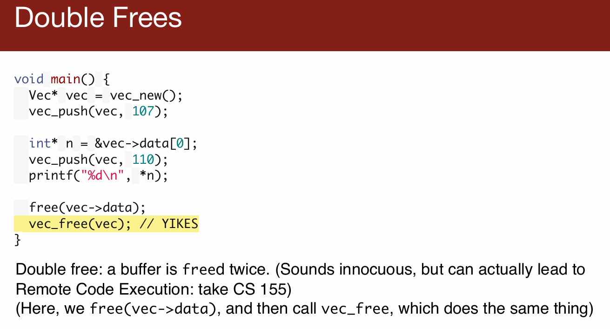

# L03 Memory Safety 内存安全

---

今天的讲座将重点讨论程序中经常出现的内存错误。我们将研究这些错误如何激发 Rust 的所有权模型，并解释 Rust 如何防止它们。

## 课前练习

*此练习由 Will Crichton 为 CS 242 开发。谢谢 Will，让我们借用此材料！*

上课前，请花 10 分钟回顾一下向量的以下 C 实现。至少有7个错误。你不需要把它们全部抓到，但要尽可能多地发现它们。

请写下您发现的错误。我们将在课程开始时审查您的发现。

```c
#include <stdio.h>
#include <stdlib.h>
#include <assert.h>

// There are at least 7 bugs relating to memory on this snippet.
// Find them all!

// Vec is short for "vector", a common term for a resizable array.
// For simplicity, our vector type can only hold ints.
typedef struct {
  int* data;     // Pointer to our array on the heap
  int  length;   // How many elements are in our array
  int  capacity; // How many elements our array can hold
} Vec;

Vec* vec_new() {
  Vec vec;
  vec.data = NULL;
  vec.length = 0;
  vec.capacity = 0;
  return &vec;
}

void vec_push(Vec* vec, int n) {
  if (vec->length == vec->capacity) {
    int new_capacity = vec->capacity * 2;
    int* new_data = (int*) malloc(new_capacity);
    assert(new_data != NULL);

    for (int i = 0; i < vec->length; ++i) {
      new_data[i] = vec->data[i];
    }

    vec->data = new_data;
    vec->capacity = new_capacity;
  }

  vec->data[vec->length] = n;
  ++vec->length;
}

void vec_free(Vec* vec) {
  free(vec);
  free(vec->data);
}

void main() {
  Vec* vec = vec_new();
  vec_push(vec, 107);

  int* n = &vec->data[0];
  vec_push(vec, 110);
  printf("%d\n", *n);

  free(vec->data);
  vec_free(vec);
}
```

今天开始讨论Rust的所有权模型。整个讲座我们都将试图理解这一模型，并探讨它是如何避免常见的内存错误的。

## Vector练习讨论

如果你参加了Vector的练习，可能对内存错误有些了解，比如双重释放或在107课程中遇到的错误。今天，我们将花时间详细讨论这个练习。同时，感谢Will为这个练习所做的贡献，他去年教过242课程。

## 分组讨论和探索内存错误

接下来，我们将分组进行讨论，你可以在小组中介绍自己，讨论你发现的错误，或者可能没有发现的问题。之后，我们将再次集中讨论，深入了解这些错误的具体情况。如果你在讲座前没有时间看这个练习，可以在课程网站上找到第三讲的笔记和代码，进行快速浏览。

## 发现并识别内存错误

我们的首要任务是识别出内存错误，了解我们通过转向这种新的编程语言能够避免哪些类型的错误。在周四，我们将更深入地讨论Rust的内存错误和其他可能帮助我们解决问题的特性。

## 代码问题与哲学思考

代码中存在许多问题，有些问题看起来应该是问题，但由于其他更严重的问题，它们可能并不是主要问题。我们将简要概述四个最重要的bug，以便你能够了解。

### 内存泄漏

Vec的push操作在分配新的双倍大小的缓冲区时未能释放旧的缓冲区，这导致内存泄漏。


### 双重释放

在主函数的最后两行中，Vec的数据被释放了两次，这是一个严重的bug，可能会导致远程代码执行，即攻击者发送恶意数据并控制你的程序。



## 悬空指针问题

悬空指针是指向已经不存在的内存的指针，这个概念可能有些难以理解，所以我想确保每个人都能明白。

### 程序的堆栈

每个程序都有一个堆栈。从`main`函数开始，`main`调用`vec_new`函数，该函数在堆栈帧上为这个向量分配空间。这里的前三行代码初始化了向量，并将一个指向该向量的指针返回给`main`函数。

### 指针失效

虽然到目前为止，这张图看起来一切正常，但一旦返回，原来的堆栈帧就消失了。接下来`main`函数调用`vec_push`函数，创建一个新的堆栈帧，`vec_push`有一些局部变量，需要在堆栈上分配空间。但此时，如果你尝试使用这个向量的指针，它指向的将是未知的、可能是垃圾的数据，如果你尝试将这些数据当作向量来使用，就会遇到问题。


> 图中展示的是一个常见的悬空指针问题。这个问题源于尝试从函数中返回一个局部变量的地址。我们来具体解释这个情况：
>
> ### 程序的堆栈结构
>
> 在这个示例中，每个程序都有自己的堆栈，用于存储函数调用时的局部变量。从`main`函数开始，它调用了`vec_new`函数。`vec_new`函数在堆栈上创建了一个`Vec`类型的局部变量`vec`，并初始化它的各个字段（`data`设置为`NULL`，`length`和`capacity`都设置为0）。
>
> ### 悬空指针的产生
>
> `vec_new`函数试图返回指向局部变量`vec`的指针。在函数中，这看起来是合理的，因为指针确实指向了一个有效的`Vec`对象。然而，一旦`vec_new`函数执行完成，其堆栈帧（包括其中的局部变量`vec`）将被销毁。这意味着返回到`main`函数后，任何尝试访问这个指针的操作都将访问到已经被释放的堆栈空间。
>
> 
>
> ### 结果和危险
>
> 当`main`函数使用从`vec_new`返回的指针时，它实际上是在访问不再存在的内存。这导致未定义行为，可能会引发程序崩溃或更严重的安全问题。此类错误通常很难调试，因为它们可能不会立即导致程序失败，而是导致数据损坏或在程序的其他部分产生难以追踪的错误。
>
> 这个示例很好地说明了为什么在C或类似语言中从函数返回局部变量的地址是不安全的，以及为什么这种做法应该被避免。正确的做法是在堆上分配内存（例如使用`malloc`），确保内存的生命周期超过函数的执行期，或者设计函数以避免需要返回内部指针。

### 迭代器失效问题

在这里还有另一种类型的悬空指针，称为迭代器失效错误。迭代器是对向量中某个位置的引用，通常从容器的开始遍历元素。如果你修改了容器（如向向量中添加元素），迭代器可能会失效，但编译器不会阻止你继续使用它。例如，当我们执行`vec_push`，如果这触发了重新分配，我们会将元素复制到新的缓冲区，旧的缓冲区应该被释放（尽管因为另一个错误，实际上并未释放）。此时，迭代器`n`指向的是已被释放的内存，这块内存可能已经被其他代码重用。如果你尝试使用`printf`输出起始元素，你实际上是在解引用一个不确定的数据，因为该内存已经被释放，可能已被其他用途占用。


## 代码质量问题

### 轻率的编码

这段代码可以说是非常草率的，编写时缺乏前瞻性。例如，关于何时分配内存、何时释放内存的考虑明显不足。代码中的处理方式显得有些杂乱无章，比如仅仅因为需要向量的指针，就随意地取一个引用并返回，这最终导致了悬空指针的问题。代码中的重新分配和释放内存的操作也显得相当随意，缺乏清晰的计划和结构。

### 编程初学者的难题与解决策略

我们可以通过106A课程中的“石匠卡罗问题”来类比。在这个问题中，一个名叫卡罗的小机器人需要在不同的列中放置钻石。对于编程初学者来说，尽管问题看似简单，实际上要实现这一功能却颇具挑战，需要处理大量依赖于当前情境的控制流。

在106A的前两周，我们强调要将问题分解、分解再分解，将大问题拆解为可以独立理解的小组件，然后将这些组件组合起来解决问题。例如，可以分解为“当前面是清晰的时候，修复一列，然后前进到下一列，再修复，继续这样操作”。


### 缺乏结构和计划

与石匠卡罗问题的自然分解相反，我们讨论的这个向量问题缺乏结构和计划，你需要同时考虑整个程序，比如在释放内存时需要考虑到这个指针实际上是指向堆栈上的某个元素，或者在重新分配内存时需要考虑多个因素。这种方式迫使你必须同时把所有事情都考虑在内，而我们希望能够在更高层次上考虑大局，然后再独立地考虑各个小组件，而不是一次性承担所有的负担。

## 前置条件与后置条件的重要性

在编程实践中，我们强调前置条件和后置条件的概念，这是确保代码质量的关键策略之一。

### 前置条件和后置条件的定义

前置条件是在函数运行之前应当满足的条件，而后置条件是函数运行完成后应当满足的条件。例如，修复列的后置条件可能是卡罗面向南方或东方。重要的是这些条件必须是一致的，我们需要明确知道在完成一列的修复后，卡罗将面向一个确定的方向，这样“移动到下一列”的函数就可以预期卡罗的位置，并据此执行相应的旋转或移动命令。

### 独立推理和组件整合

通过定义清晰的前置和后置条件，我们可以孤立地推理每一个小部分的功能，确保它们的逻辑独立于整体。如果一个函数的后置条件与下一个函数的前置条件匹配，我们可以确信这些组件能够很好地协同工作。这样，我们就能将各个组件串联起来，构建出一个结构完整的程序，而无需关注每一个细节。

### 程序员的责任

确保前置和后置条件得到满足是程序员的责任。通常，在函数定义中并不会明确指出这些条件，而是通过注释来说明，如“此函数执行后卡罗应面向东方”。这一点在实现如向量这类结构时尤为重要，尤其是在手动管理内存的情况下，程序员需要清楚地了解内存管理的全局情景。

### 复杂程序中的内存管理

在任何复杂的程序中，内存的分配、传递及释放都是关键问题。程序中的内存应当在何时释放？如果过早释放，可能会出现“使用后释放”的错误，即代码的其他部分仍在使用那块内存；如果没有适当地释放内存，则会导致内存泄漏。因此，高层次的规划非常重要，需要明确哪部分代码负责内存的管理，具体哪个函数负责释放内存，以及如何释放。

### 手动内存管理与所有权概念

在阅读优秀的C和C++代码时，你会发现“所有权”这一概念的自然出现，这是因为开发者开始定义内存的使用规则。虽然“所有权”在过去30到40年间并没有一个明确的定义，但它是人们在手动内存管理代码中尝试设置前置和后置条件的一个实例。

## 手动内存管理的复杂性

在讨论手动内存管理时，我们可以通过一些项目实例来理解这一过程的复杂性及其必要的管理策略。

### 内存管理的前置和后置条件

在OpenvSwitch项目中，某函数负责分配字符串并存储其指针于`error_p`中，调用者负责释放这块内存。这里的后置条件明确指出，内存的释放责任属于调用者。这种明确的责任划分是内存管理中常见的做法，有助于防止内存泄漏或其他内存错误。


### 责任转移和清理函数

在另一示例中，来自FFmpeg项目的函数处理传入的字典，但不对字典值进行内存释放，释放责任仍旧由调用者承担。这展示了即便在临时使用内存的情况下，明确的责任界定也是必需的。


在一个不同的案例中，传入的数据被传递给代码库的另一个组件（boot sysfs lib），由该组件负责最终的内存释放。这种内存的“所有权转移”是高级内存管理策略的一个例子，需要在代码中清晰地定义并通过注释说明。


### 自定义清理函数的应用

在复杂的C和C++项目中，通常会看到包含多个结构体和指针的数据结构。这些结构体可能需要通过特定的清理函数来释放，而不是简单的`free`调用。例如，一个结构体可能包含指向另一个需要释放的结构体的指针。这要求开发者不仅要管理直接分配的内存，还要考虑间接关联的内存。


### 手动内存管理中的所有权概念

所有权的概念在手动内存管理中至关重要。良好的代码应当清楚地标示哪部分代码负责内存的分配，哪部分代码负责释放，以及在内存传递过程中的责任如何转移。例如，某些情况下代码的一部分可能仅需要字典的键，而另一部分则需要值，因此，清理工作需要在不同的代码部分中进行，遵循明确的规则和责任划分。


### 编码中的所有权思维模式

编程时采用类比思维模式，将代码视为承担不同职责的“人”，可以帮助开发者更好地理解和实现复杂的内存管理。通过这种方式，每个函数或代码块就像是在处理特定任务的个体，负责特定资源的管理和清理。

## 编写清晰的内存管理代码

在手动内存管理中，确保正确的内存操作至关重要。这一部分的讲解强调了编写代码时，如何通过注释和良好的编程实践来明确内存的管理责任。

### 函数注释和内存管理

在编写函数时，通过注释明确指出函数如何处理内存是一种常见的做法。例如，可以在函数注释中写明“此函数接收一个缓冲区并不负责释放它，所有权仍由调用者保留”。这样做可以帮助调用该函数的其他开发者明白他们需要负责释放内存，以避免内存泄漏。

### C语言中的类型系统和内存错误

C语言的类型系统较为简单，主要包括数值、指针和结构体等。这种简单性在一定程度上限制了语言表达内存管理细节的能力。例如，函数可能会返回一个指向字符序列的指针，但编译器无法从语言层面理解这个指针指向的内存需要由谁来释放。

### 静态分析的局限性

虽然静态分析工具可以帮助发现一些编程错误，但它们通常无法完全理解开发者在注释中表达的前置条件和后置条件。因此，即便静态分析显示代码没有问题，实际上可能仍存在因未遵循内存管理规则而导致的问题。

### 高级语言的类型系统

探索是否有更好的类型系统可以帮助更准确地表达开发者的意图是本课的关键问题。一个理想的类型系统将能够理解如内存分配和释放这样的操作，使得编译器能够验证代码是否满足了预设的条件。

### Rust语言中的内存管理

讲座最后介绍了Rust语言如何处理内存管理问题。Rust通过其所有权和借用检查机制，在语言层面上提供了对内存管理的支持，帮助开发者避免了C语言中常见的内存错误，如悬空指针和双重释放等问题。Rust的高级类型系统能够更准确地理解和检查开发者的编程意图，从而提高代码的安全性和健壽命。

## Rust 中的所有权概念

讨论了Rust语言中的所有权概念，如何通过语言机制而不是单纯的注释来管理内存，以及这种方法如何帮助避免常见的内存错误。

### 所有权的基本理解

在Rust中，每个变量都拥有其赋值的对象。例如，当你写下 `let julio = bear_get();`，Julio变量就拥有了从`bear_get()`返回的bear对象。这意味着Julio不仅拥有使用这个bear的权利，更重要的是，他负责在不需要这个bear时正确地处理它（例如释放内存）。


### 所有权转移的影响

当所有权从一个变量转移到另一个变量时，如从Julio到Ryan，原始变量（Julio）将失去对该对象的访问权限。在代码中，这体现为 `let ryan = julio;` 后，Julio变量不能再操作或访问bear对象，所有权以及随之而来的责任（如释放内存）完全转给了Ryan。这个转移保证了在任何时刻，对象只有一个明确的所有者，从而避免了例如重复释放（double free）等内存错误。


### Rust的内存安全保证

通过这种方式，Rust语言确保每个对象都有一个且只有一个所有者，同时确保当所有者变量离开作用域时，对象占用的内存会被自动释放。这种机制有效地防止了内存泄漏和许多其他类型的内存错误，因为编译器会强制要求开发者遵守这些规则，而不是依赖于开发者记住并在注释中说明。

### 内存管理的自动化

在Rust中，当对象的所有权被转移给新的变量时，原有变量会自动失去访问权限，这个过程不需要程序员显式地释放内存。这一点从根本上简化了内存管理，因为开发者不需要（也无法）手动释放内存，所有这些都由编译器自动处理。


### 所有权和可变性

Rust的所有权系统还与可变性（mutability）紧密相关。所有者可以决定对象是否可变，以及在什么条件下可以将访问权限（可读或可写）授予其他变量或函数。这进一步增强了Rust在并发编程中的安全性和效率。

总的来说，Rust的所有权机制不仅提高了代码的安全性，还通过减少开发者需要直接管理内存的需要，降低了编程的复杂性。这种方法有助于开发者集中精力解决业务逻辑问题，而非被底层内存管理问题所困扰。

## Rust 语言中的所有权演示

在此部分中，我们通过一个简单的[Rust代码示例](https://play.rust-lang.org/?version=stable&mode=debug&edition=2018&code=%0D%0Afn%20main()%20%7B%0D%0A%20let%20julio%20=%20%22Hi,%20friends!%22.to_string();%0D%0A%20let%20ryan%20=%20julio;%0D%0A%20%0D%0A%20/*%20Print%20what%20the%20value%20of%20ryan%20is!%20*/%0D%0A%20println!(%22%7B%7D%22,%20ryan);%0D%0A%20%0D%0A%20/*%20Print%20what%20the%20value%20of%20julio%20is%20*/%0D%0A%20//println!(%22%7B%7D%22,%20julio);%0D%0A%7D)来进一步探讨和理解Rust中的所有权概念及其在内存管理中的作用。

> 你可以尝试在下面编辑和运行它。

```rust,editable
fn main() {
 let julio = "Hi, friends!".to_string();
 let ryan = julio;
 
 /* Print what the value of ryan is! */
 println!("{}", ryan);
 
 /* Print what the value of julio is */
 //println!("{}", julio);
}
```


### 所有权在Rust中的实际运行

在这个例子中，我们首先创建了一个变量 `julia` 并赋予它一个字符串 `"Hi friends"`。紧接着，我们通过 `let ryan = julia;` 将 `julia` 的内容（即之前的字符串）赋予给了 `ryan`，模拟了所有权的转移。

### 所有权转移后的效果

当所有权从 `julia` 转移到 `ryan` 后，尝试再次使用 `julia` 变量访问原字符串会导致编译错误。在Rust中，这种操作被认为是尝试使用一个已经移动（moved）的值，因此 `julia` 已无法再访问那个字符串。这显示了Rust如何通过所有权系统防止悬空引用和重复释放等内存错误。

### 编译器的角色和错误提示

在尝试打印 `julia` 的值时，Rust编译器会抛出错误，说明 `julia` 变量尝试访问一个已移动的值。这种错误提示是Rust内存安全特性的一部分，它确保开发者不能错误地访问或修改已经转移所有权的数据。这个机制有助于开发者在开发阶段就识别并修正潜在的内存错误，而不是在程序运行时才暴露问题。

### 所有权和变量的可变性

尽管一个变量的初始值可能被转移走，Rust允许变量再次被赋予新的值，赋予新的所有权。例如，虽然 `julia` 失去了对原始字符串的所有权，我们可以再次赋值给 `julia` 一个新的对象，这样 `julia` 将拥有新对象的所有权。这体现了Rust中所有权、变量可变性和内存管理之间的灵活交互。

### 常量与变量的默认行为

在Rust中，变量是否默认为常量（不可变）取决于是否使用了 `mut` 关键字。不使用 `mut` 的变量是不可变的，即不能在赋值后更改其值。这是Rust强类型系统的一部分，旨在进一步加强代码的安全性和可预测性。

通过这个简单的示例，我们可以看到Rust如何通过编译器检查和强制的所有权规则来简化内存管理并提高程序的安全性。这种方法减少了程序运行时可能出现的错误，使开发者能更专注于业务逻辑的实现。

## 函数与所有权

在 Rust 中，函数也可以拥有对传入对象的所有权，这影响了数据的使用和内存管理。

### 函数获取所有权的示例

当一个变量被传递给函数时，这个变量的所有权可能被转移给该函数。例如，如果 `julio` 拥有一个对象，并将其传递给 `my_coolbear_function`，那么这个函数就获得了对象的所有权，与之前变量 `ryan` 从 `julio` 获得所有权的情形相似。一旦所有权被函数获取，原始变量 `julio` 就无法再访问该对象，尝试这样做将导致编译错误。

### 所有权转移后的内存责任

当函数获取了对象的所有权后，它也承担了释放该对象内存的责任。这意味着调用函数后，不需要在原来的代码片段中释放内存，这一责任已经转移到了函数内部。这种模式有助于简化内存管理，避免内存泄漏或重复释放。

## 借用与所有权

为了支持更灵活的数据操作而不失去所有权，Rust 提供了借用机制。

### 借用的概念

借用允许函数临时使用一个值而不获取其所有权。这通过在函数调用时使用引用（使用 `&` 符号）来实现。例如，`&julio` 表示借用 `julio` 持有的对象，而不是转移所有权。这样，函数可以使用对象，但对象的所有权和释放责任仍然在原所有者手中。


### 借用的好处

借用机制使得可以在不放弃所有权的情况下，安全地将数据传递给函数。这对于实现数据的读取或修改操作非常有用，同时保证了数据的安全性和一致性。借用是 Rust 保证内存安全的关键机制之一，它防止了悬空指针和数据竞争等问题。

## Rust的内存安全保证

Rust 的所有权和借用系统确保了高级的内存安全性，所有这些检查都是在编译时完成的。

### 编译时检查

Rust编译器在编译时执行所有权和借用规则的检查，确保代码符合内存安全要求。如果代码试图违反这些规则（如使用已移动的值），编译器将阻止程序编译并提供错误信息，帮助开发者在代码运行前就解决潜在的问题。

### 避免常见内存错误

通过严格的所有权规则，Rust 帮助开发者避免了如双重释放、内存泄漏等常见的内存错误。这种自动的内存管理减少了程序崩溃的可能性，提高了应用程序的稳定性和可靠性。

总结来说，Rust 的所有权和借用模型为开发者提供了强大的工具来管理内存，同时简化了编程模型。通过编译时的严格检查，Rust 旨在消除常见的内存安全问题，使得开发更加高效和安全。

---

## Next Time + Resources [End] 

● What other kinds of references / variables can we create in Rust? 

● What does ownership transferring look like in memory? 

● More code examples :D  

● [Ownership and borrowing for visual learners! ](https://rufflewind.com/2017-02-15/rust-move-copy-borrow)

● [A great resource on iterating over vectors in Rust ](http://xion.io/post/code/rust-for-loop.html)

● [A Medium article about ownership, borrowing, and lifetimes ](https://medium.com/@bugaevc/understanding-rust-ownership-borrowing-lifetimes-ff9ee9f79a9c)

● [CS242 lecture notes](http://cs242.stanford.edu/f19/lectures/06-2-memory-safety) — shout out to Will Crichton to providing advice on  explaining some of these concepts! 

● [The Rust book](https://doc.rust-lang.org/book/ch04-00-understanding-ownership.html)

● [Check out sections 4.1 and 4.2 (deeper explanation of lifetimes)](https://doc.rust-lang.org/1.4.0/nomicon/ownership.html)
